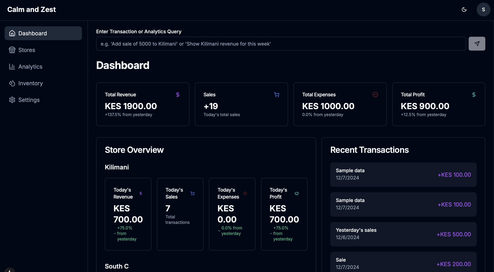

<div align="center">
  
  <br />
  
  # ✨ Calm and Zest Analytics
  
  <p align="center">
    <strong>Transform Your Business with AI-Powered Intelligence</strong>
  </p>
  
  <p align="center">
    A sophisticated Next.js platform revolutionizing business management with real-time analytics, 
    intelligent inventory tracking, and seamless multi-store operations.
  </p>

  <p align="center">
    <a href="#-key-features">Features</a> •
    <a href="#-live-demo">Demo</a> •
    <a href="#-quick-start">Quick Start</a> •
    <a href="#-tech-stack">Tech Stack</a> •
    <a href="#-architecture">Architecture</a>
  </p>

  <div align="center">
    
  </div>
</div>

---

## 🌊 Overview

Calm and Zest Analytics is revolutionizing the business industry with its elegant dark-themed interface and powerful analytics suite. Built with modern web technologies, it offers a comprehensive solution for managing multiple store locations, tracking inventory, and analyzing business performance in real-time.

## ⚡️ Key Features

### 🎯 Smart Analytics
- **Real-time Performance Tracking**: Live monitoring of sales, revenue, and inventory
- **Multi-Store Comparison**: Cross-location performance analysis with visual insights
- **Trend Analysis**: AI-powered trend detection and forecasting
- **Custom Reports**: Generate detailed reports with a single click

### 📦 Inventory Management
- **Smart Stock Tracking**: Real-time inventory levels across all locations
- **Automated Reordering**: AI-driven reorder point calculations
- **Product Categories**:
  - Refill Bottles (20L, 10L, 5L)
  - New Bottles (Full Crate, 500ml, 1L)
  - Dispensers (Hot & Cold, Normal, Stand)
  - Accessories (Pumps, Parts, Caps)

### 🚚 Delivery System
- **Live Tracking**: Real-time delivery status monitoring
- **Smart Route Planning**: AI-optimized delivery routes
- **Driver Dashboard**: Comprehensive driver management
- **Automated ETAs**: Intelligent arrival time predictions

### 💡 Intelligent Automation
- **Natural Language Commands**: Input transactions using plain English
- **Smart Notifications**: Context-aware alerts and reminders
- **Automated Reporting**: Scheduled report generation
- **Predictive Analytics**: AI-powered business insights

## 🎨 Beautiful Interface

- **Dark Theme Optimized**: Easy on the eyes, perfect for long sessions
- **Responsive Design**: Seamless experience across all devices
- **Interactive Charts**: Dynamic data visualization
- **Intuitive Navigation**: User-friendly interface

## 🚀 Quick Start

```bash
Node.js >= 15.0.0
npm >= 7.0.0 or yarn >= 1.22.0
Google Cloud Platform account
```

### Environment Setup

Create `.env.local`:

```env
GOOGLE_SHEETS_PRIVATE_KEY=your_private_key
GOOGLE_SHEETS_CLIENT_EMAIL=your_client_email
GOOGLE_SHEETS_SPREADSHEET_ID=your_spreadsheet_id
NEXTAUTH_SECRET=your_nextauth_secret
NEXTAUTH_URL=http://localhost:3000
```

### Quick Start

```bash
# Clone repository
git clone https://github.com/ShalomObongo/czest-analytics.git

# Install dependencies
npm install

# Launch development server
npm run dev
```

## 🛠 Tech Stack

- **Framework**: Next.js 13+ with App Router
- **UI Components**: Radix UI + Tailwind CSS
- **Authentication**: NextAuth.js
- **Analytics**: Custom analytics engine
- **Database**: Google Sheets integration
- **Charts**: Recharts
- **Icons**: Lucide React

## 🏗 Architecture

```
src/
├── app/
│   ├── (auth)/
│   │   └── login/
│   ├── (dashboard)/
│   │   ├── dashboard/
│   │   ├── inventory/
│   │   ├── analytics/
│   │   └── settings/
│   └── api/
├── components/
│   ├── ui/
│   └── dashboard/
│       ├── inventory/
│       └── analytics/
```

## 🔐 Security Features

- **Enterprise-grade Security**: Robust authentication system
- **Role-based Access**: Granular permission control
- **Data Encryption**: Secure data transmission
- **Session Management**: Secure session handling

### Dashboard Elements
- **Store Overview**: Real-time performance metrics
- **Transaction Input**: Natural language command processing
- **Inventory Management**: 
  - Stock Management Interface
  - Delivery Tracking System
- **Analytics**: 
  - Store Comparison Charts
  - Revenue Analytics
  - Performance Metrics

## 🔒 Security & Performance

### Authentication
- NextAuth.js powered security
- Session-based authentication
- Protected API routes

### Performance Optimization
- Static and dynamic rendering strategies
- Intelligent data caching
- Optimized asset delivery
- Type-safe operations with TypeScript

## 📱 Progressive Web App

- **Offline Support**: Work without internet connection
- **Install on Device**: Add to home screen
- **Push Notifications**: Stay updated with alerts
- **Auto Updates**: Always up to date

## 🤝 Support

For support, email support@czestanalytics.com or join our Slack channel.

## 📄 License

Copyright © 2024 Czest Analytics. All rights reserved.

---

<div align="center">
  <sub>Built by Shalom</sub>
</div>
